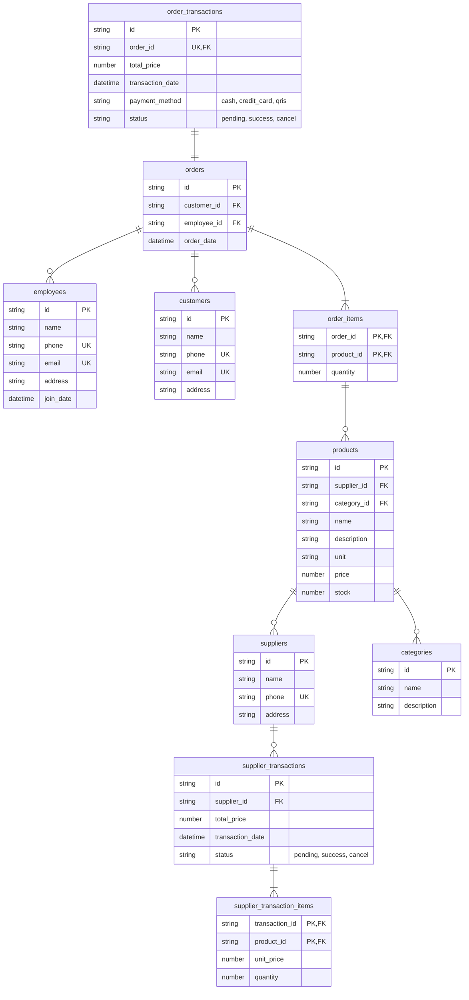

# IT Mart
Praktikum Sistem Basis Data Modul 1

## Data Diri
Nama : Ardhi Putra Pradana

NRP : 5027241022

Kelas : C

Asisten : NOPS

## ERD (Crow's Foot)

> - **PK** : Primary Key
> - **FK** : Foreign Key
> - **UK** : Unique Key

## Penjelasan

Berikut adalah penjelasan singkat mengenai table - table dan juga column - column yang digunakan pada ERD diatas.

### suppliers

Table ini digunakan untuk manajemen supplier yang terhubung dengan product.

> - **id** : Digunakan sebagai identifier utama dan primary key dari tiap data supplier
> - **name** : Digunakan untuk menyimpan nama pihak supplier tersebut
> - **phone** : Digunakan untuk menyimpan nomor telepon dari pihak supplier, dan harus bersifat *unique*
> - **address** : Digunakan untuk menyimpan alamat lengkap supplier

---

### supplier_transactions

Table ini digunakan untuk mencatat transaksi dengan pihak supplier, dimana table ini memiliki relasi dengan table *suppliers*

> - **id** : Digunakan sebagai identifier utama dan primary key untuk setiap data transaksi supplier
> - **supplier_id** : Merupakan foreign key yang akan menghubungkan relasi dengan table *suppliers*
> - **total_price** : Digunakan untuk menyimpan total transaksi supplier
> - **status** : Digunakan untuk menyimpan bagaimana status transaksi dengan supplier, terdapat 3 tipe yaitu *pending, success, cancel*

---

### supplier_transaction_items

Table ini digunakan untuk menyimpan setiap data item - item apa saja yang dipesan ketika melakukan transaksi dengan supplier, artinya dalam sekali transaksi dapat memiliki banyak items. Dan table ini memiliki relasi dengan table *products* untuk mencatat product apa yang disupply.

> Pada table ini menggunakan *composite primary key*, dimana primary key diset dengan kombinasi column *transaction_id* dan *product_id*

> - **transaction_id** : Merupakan foreign key yang akan menghubungkan relasi dengan table *supplier_transactions*, sekaligus sebagai primary key
> - **product_id** : Merupakan foreign key yang akan menghubungkan relasi dengan table *products*, sekaligus sebagai primary key
> - **unit_price** : Digunakan untuk menyimpan harga per-unit dari supplier (bukan harga jual)
> - **quantity** : Digunakan untuk menyimpan jumlah quantity yang disupply oleh supplier

---

### categories

Table ini digunakan untuk menyimpan kategori - kategori product yang ada.

> - **id** : Digunakan sebagai identifier utama dan primary key untuk setiap data category
> - **name** : Digunakan untuk menyimpan nama category
> - **description** : Digunakan untuk menyimpan informasi detail mengenai category terkait

---

### products

Table ini digunakan untuk menyimpan data - data product yang ada, sekaligus memiliki relasi dengan *suppliers* dan juga *categories*

> - **id** : Digunakan sebagai identifier utama dan primary key untuk setiap data product
> - **supplier_id** : Merupakan foreign key yang akan menghubungkan relasi dengan table *suppliers*
> - **category_id** : Merupakan foreign key yang akan menghubungkan relasi dengan table *categories*
> - **name** : Digunakan untuk menyimpan nama product
> - **description** : Digunakan untuk menyimpan informasi detail dari product terkait
> - **unit** : Digunakan untuk menyimpan tipe satuan dari product terkait, cont: kg, pcs, lembar, liter, dll
> - **price** : Digunakan untuk menyimpan harga jual per-unit dari product terkait
> - **stock** : Digunakan untuk menyimpan total stock barang yang tersedia

---

### employees

Table ini digunakan untuk menyimpan data employee atau karyawan

> - **id** : Digunakan sebagai identifier utama dan primary key untuk setiap data karyawan
> - **name** : Digunakan untuk menyimpan nama karyawan
> - **phone** : Digunakan untuk menyimpan nomor telepon karyawan, dan harus bersifat *unique*
> - **email** : Digunakan untuk menyimpan email karyawan, dan harus bersifat *unique*
> - **address** : Digunakan untuk menyimpan alamat lengkap dari karyawan
> - **join_date** : Digunakan untuk menyimpan kapan karyawan tersebut bergabung sebagai pekerja

---

### customers

Table ini digunakan untuk menyimpan data customers atau pelanggan

> - **id** : Digunakan sebagai identifier utama dan primary key untuk setiap data pelanggan
> - **name** : Digunakan untuk menyimpan nama pelanggan
> - **phone** : Digunakan untuk menyimpan nomor telepon pelanggan, dan harus bersifat *unique*
> - **email** : Digunakan untuk menyimpan email pelanggan, dan harus bersifat *unique*
> - **address** : Digunakan untuk menyimpan alamat lengkap dari pelanggan

---

### orders

Table ini digunakan untuk mencatat sebuah pesanan, yang dimana akan memiliki relasi pelanggan yang melakukan order, dan juga memiliki relasi ke keryawan yang melayani pesanan tersebut

> - **id** : Digunakan sebagai identifier utama dan primary key untuk setiap data pesanan
> - **customer_id** : Merupakan foreign key yang akan menghubungkan relasi dengan table *customers*
> - **employee_id** : Merupakan foreign key yang akan menghubungkan relasi dengan table *employees*
> - **order_date** : Digunakan untuk menyimpan kapan pesanan dibuat

---

### order_items

Table ini digunakan unuk menyimpan item atau barang apa saja yang dibeli/diorder oleh pelanggan, dimana table ini akan memiliki relasi dengan table *orders* dan juga table *products*

> Pada table ini menggunakan *composite primary key*, dimana primary key diset dengan kombinasi column *order_id* dan *product_id*

> - **order_id** : Merupakan foreign key yang akan menghubungkan relasi dengan table *orders*, sekaligus sebagai primary key
> - **product_id** : Merupakan foreign key yang akan menghubungkan relasi dengan table *products*, sekaligus sebagai primary key
> - **quantity** : Digunakan untuk menyimpan seberapa banyak unit yang dipesan oleh pelanggan

---

### order_transactions

Table ini digunakan untuk menyimpan mekanisme pembayaran dan catatan aktivitas pembayaran dari sebuah order atau pesanan, dimana table ini akan memiliki relasi ke table *orders*

> - **id** : Digunakan sebagai identifier utama dan primary key untuk setiap data transaksi
> - **order_id** : Merupakan foreign key yang akan menghubungkan relasi dengan table *orders*, dan harus bersifat *unique*, karena 1 transaksi hanya dapat dimiliki oleh 1 order
> - **total_price** : Digunakan untuk menyimpan total harga dari pesanan yang dibuat
> - **transaction_date** : Digunakan untuk menyimpan aktivitas  transaksi melalui tanggal dan waktu, dimana akan berubah sesuai dengan column *status*
> - **payment_method** : Digunakan untuk menyimpan metode pembayaran yang digunakan pada transaksi dari sebuah pesanan
> - **status** : Digunakan untuk menyimpan status transaksi, dimana memiliki 3 nilai yaitu *pending, success, cancel*